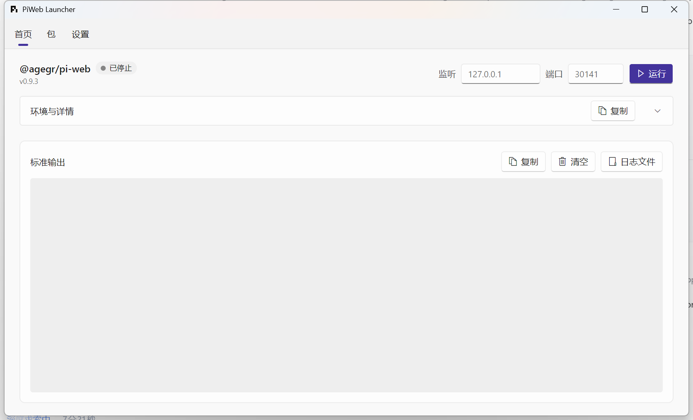
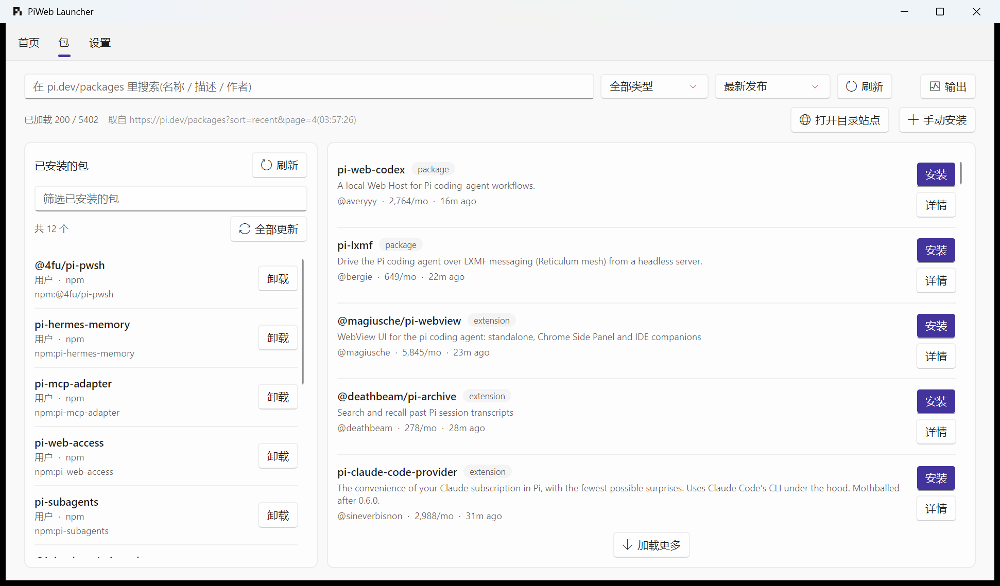
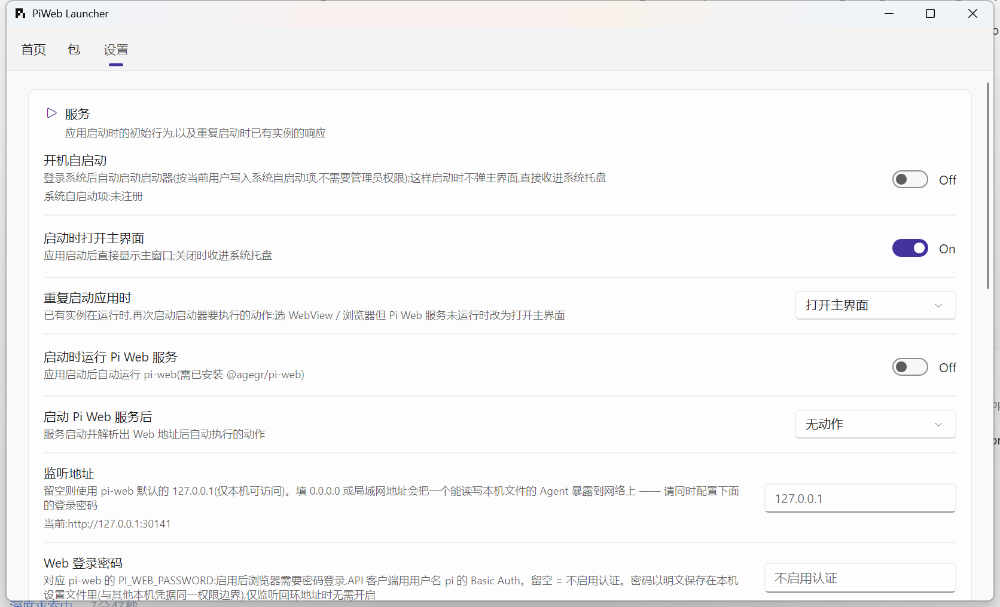

# PiWeb Launcher

[Pi Web (pi-web)](https://github.com/agegr/pi-web) 的桌面启动器 —— 用 Avalonia 打造的 Windows 图形化外壳。

它把 `pi-web` 的安装、启停、Web 界面访问,以及 pi 的**包管理**这些命令行操作，收进一个常驻系统托盘的 WinUI 风格窗口里。

```
pi 的世界:  pi(终端里的 Coding Agent) ──┬── pi-web(它的浏览器界面,自带一份完整的 pi)
                                        └── pi 包(扩展 / 技能 / 主题 / 提示词模板)

PiWeb Launcher 管三件事:
  ① 把 pi-web 装好、跑起来、点开看(WebView / 浏览器)
  ② 逛 https://pi.dev/packages,一键装包、一键卸载
  ③ 常驻托盘,开机自启,重复启动只唤起不重开

不需要单独装 pi:pi-web 自己就依赖着一份完整的 pi(见下文「已知限制」)
```



---

## 功能特性

### 服务管理
- **一键安装 / 更新**：探测 `@agegr/pi-web` 是否全局安装，显示已安装版本与 npm 上的最新版本，有更新时给出「更新」按钮。
- **启动 / 停止 / 重启**：通过 `pi-web` 启动服务，从输出里识别 `Ready`（Next.js 的就绪标记，pi-web 的启动脚本正是用它来决定何时开浏览器）后置为「运行中」。
- **监听地址与端口**：可自定义 `--hostname` 与 `--port`（1–65535，留空使用 pi-web 默认的 `127.0.0.1:30141`）。
- **登录密码**：可设置 `PI_WEB_PASSWORD`，启用 pi-web 自带的密码登录与 API Basic Auth。
- **进程树清理**：停止时连同子进程一起终止（Windows 用 Job Object，其他平台用 `Kill(entireProcessTree)`），应用退出/系统关机时也会兜底停止服务。pi-web 会再拉起一个 Next.js 子进程，只杀父进程会留下还在占端口的孤儿 —— 这条路径专门处理过。
- **实时日志**：`pi-web` 的标准输出实时显示在首页日志卡片中，支持复制、清空、在文件管理器中定位日志文件。
- **启动失败诊断**：把常见失败（端口占用、Node 版本过旧、安装不完整、缺权限、无网络）翻译成可操作的提示，并把 pi-web 全局包目录、pi agent 目录、扩展安装位置当刻的状态写进 `app.log` 留证。

### 包管理（pi 的扩展 / 技能 / 主题 / 提示词模板）
pi 的包由 `pi install` 管理，pi-web 只是它们的浏览器界面。包页面做三件事：

- **浏览目录**：直接抓 [https://pi.dev/packages](https://pi.dev/packages)（官方包目录，5000+ 条）。
  - 支持按名称/描述/作者搜索、按类型筛选（extension / skill / theme / prompt）、按下载量 / 最新发布 / 名称排序 —— 这些参数**原样透传给目录站点**，由它排好再分页，启动器不在本地"排已加载的那几页"。
  - **增量加载**：目录有 100+ 页，一次全抓既慢又不礼貌；启动器一次取 4 页（200 条），点「加载更多」继续往下拉。
  - 已安装的包在目录里带绿色的「已安装 vX.Y.Z」徽标。
- **管理已安装**：读 `pi list` 的结果，补上从 pi 的 npm 目录里读到的真实版本号，逐条可**卸载**（两次点击确认，因为包能执行代码），并支持 `pi update --extensions` 一键全部更新。
- **手动安装**：输入 `npm:包名` / `git:github.com/owner/repo@v1` / `./本地路径` 直接安装（目录只收录声明了 `pi-package` 关键字且被站点抓到的包，私有包与本地开发包只能手输）。
- **安装输出**：筛选栏右侧的「输出」按钮开关一个**浮窗**（不占页面高度 —— 常驻一块输出区会白白吃掉列表的竖向空间）。
  浮窗从筛选栏下方垂下来盖在内容上，支持复制 / 清空 / 关闭，点浮窗外的空白处或按 `Esc` 也能关；
  关着时若有新输出，按钮上会亮一个小圆点。装卸这类要等网络的操作会自动把它弹出来。
  装/卸完成且服务在运行时，还会问一句要不要立刻重启服务（pi 的扩展在**会话启动时**加载，运行中的 pi-web 不会自动装载新包）。

> 数据来源三分，各自独立：**已安装**来自 `pi list`，**目录**来自 pi.dev 的网页，**版本号**来自 pi 自己的 `<agent>/npm` 目录。启动器**不解析、更不写** `~/.pi/agent/settings.json` —— 那个字段有字符串、对象、带过滤数组等多种形态，猜格式迟早写坏用户设置。

> **`pi` 命令从哪来**：PATH 上的全局 `pi` 优先；没有就用 **pi-web 自带的那份**（`pi-web` 依赖里那份 `@earendil-works/pi-coding-agent` 是完整包，自带 CLI）。
> 也就是说**只要装了 Pi Web，包管理就能用**，不必再单独装一次 pi。用自带那份时界面会写明这一点。



### 开机自启动
默认**关闭**，在设置页「服务」卡片里开启：开启后把启动器写进系统自启动项（**当前用户**级，不需要管理员权限），
下次登录系统时自动拉起，并**直接收进系统托盘**（不弹主界面 —— 登录就弹窗是自启动最容易被关掉的原因），
服务再按「启动时运行 Pi Web 服务」照常启动。由系统拉起的这次启动会带 `--autostart` 标记，app.log 里据此可分辨。

- **落点**：Windows 是注册表 `HKCU\Software\Microsoft\Windows\CurrentVersion\Run` 下名为 `PiWeb Launcher` 的字符串值；
  macOS 是 `~/Library/LaunchAgents/com.piweb-launcher.autostart.plist`；Linux 是 `~/.config/autostart/piweb-launcher.desktop`。
  写进去的是**带引号的当前程序路径** + `--autostart`，所以安装路径含空格也没问题。
- **自愈**：每次启动都会把系统侧与设置对齐 —— 程序换了安装目录会更新、注册项被手工删掉会补写、
  设置关着却还残留着旧注册项会清除（`AutoStartService.Reconcile`）。只在**确有差异**时才写系统。
- 设置页那一行下方显示的是**系统侧的真实状态**（已注册 / 未注册 / 指向其它路径），鼠标悬停可看到完整位置与内容。
- 写入失败（组策略、安全软件拦截）时开关会退回原状，并把原因写在状态行里。

### 环境信息
首页可展开的面板，展示运行状态（PID / 启动时刻）、应用版本、已安装版本、实际/配置的 Web 地址、Node.js 与 npm 版本、`pi` 与 `pi-web` 命令路径、pi 数据目录、WebView 引擎版本。

### Web 界面访问
- **应用内打开**：内置 WebView 窗口（Windows 走 WebView2，macOS 走 WKWebView）。
- **浏览器打开**：调用系统默认浏览器。
- **复制 URL**：把地址复制到剪贴板（pi-web 没有 token，地址由监听地址与端口唯一推导）。

WebView 做了两项体验优化：
- **窗口复用**：关闭时默认只隐藏而非销毁，再次打开是毫秒级复用。
- **空闲释放**：隐藏超过设定时长（默认 5 分钟，可关闭该行为）后自动关闭并释放 WebView 进程内存。

### 系统托盘
- 单击 / 双击托盘图标可分别配置为：在 WebView 中打开、在浏览器中打开、显示主界面、无动作。
- 关闭主窗口默认最小化到托盘（可配置为直接退出）。
- 托盘右键菜单可控制服务启停与退出程序。

### 重复启动
启动器是单实例常驻程序：再次启动不会开出第二个实例，而是通知已在运行的实例按设置页的「重复启动应用时」响应 ——
无动作 / 打开主界面 / 打开 WebView / 打开浏览器。选后两项但服务未运行（拿不到 Web 地址）时改为打开主界面；默认打开主界面。

### 设置
WinUI 卡片式设置页，四组：

| 卡片 | 设置项 |
|---|---|
| **服务** | 开机自启动、启动时打开主界面、重复启动时的动作、启动时自动运行服务、服务就绪后的动作、**监听地址**、**Web 登录密码**、**允许服务自己打开浏览器** |
| **环境** | npm 源（使用配置源 / 官方 / npmmirror / 腾讯云 / 华为云）、HTTP 代理、不走代理的地址 |
| **系统托盘** | 单击动作、双击动作 |
| **WebView** | 应用内链接打开方式、关闭时保留窗口、保留超时（分钟） |

环境设置会注入到 `npm` / `pi install` 等子进程，以及包目录下载所用的 HTTP 客户端；
**服务进程只注入代理、不注入 npm 源**（服务里没有 npm 操作，而 `npm_config_*` 会跟着环境被 pi 的子进程继承，
让结果与用户在自己终端里跑出来的不一样）。**不影响已在运行的服务**。



### 窗口状态记忆
自动记住主窗口与 WebView 窗口的位置、尺寸、最大化状态，下次启动还原。

---

## 技术栈

| 项 | 版本 |
|---|---|
| .NET | `net10.0`（SDK 10.0.401） |
| Avalonia | 12.1.1 |
| Avalonia.Controls.WebView | 12.1.0 |
| FluentAvaloniaUI | 3.1.0（WinUI 风格控件与主题） |

架构上刻意保持简单：**无 DI 容器、无 MVVM 框架**，UI 采用 code-behind + `x:Name`，业务逻辑集中在 `Services/` 下的单例服务中。服务事件在后台线程触发，UI 侧统一通过 `Dispatcher.UIThread.Post` 回到 UI 线程。

几处刻意划出的边界：

- **子进程只有一个出口**（`ChildProcessRunner`）：定位命令、注入 npm 源/代理、按行判定编码（Node 写 UTF-8、`cmd.exe` 自身消息是 OEM 代码页）、等待输出读完，全部收在这里；pi 命令的定位与执行单独放在 `PiCli`，包页面因此不必依赖整个 `PiWebService`。
- **pi 的三件事分开写**：读设置一律走 `pi` 命令（`PiCli`）、读目录只读地扫 `<agent>/npm`（`PiNpmDirectoryReader`）、逛包目录抓网页（`PiCatalogReader` + `PiPackageService`）。三者互不依赖，各自可测。
- **"格式知识"单独成文件**：`PiCatalogReader`（pi.dev 的卡片结构）、`PiListReader`（`pi list` 的输出形态）、`AutoStartEntry`（三个平台的自启动项格式）都是纯字符串/纯映射，被单元测试逐字盯住。
- **跨页面的 UI 状态没有重复实现**：日志限长（`LogBuffer`）、刷新节流（`LogAppendThrottle`）、复制反馈（`CopyFeedback`）、卡片外观与代码区底色（`App.axaml`）都是单一定义。
- **最微妙的两块各自独立成文件**：`SingleInstanceGuard`（互斥体 + 命名管道）与 `CompatChainEscape`（上游进程链逃逸，附完整成因说明）——它们都是"改错了很难查"的逻辑，不该混在窗口/托盘代码里。
- **状态挂数据对象、不挂控件**：列表是虚拟化的（容器会回收复用），所以"待确认卸载"这类状态存在 `PiInstalledPackage` 上，而不是写在 `Button.Content` 里。
- **命名空间与文件夹一致**：`Services/Packages/*` → `PiWeb_Launcher.Services.Packages`，`Views/Shared/*` → `PiWeb_Launcher.Views.Shared`。

---

## 构建与运行

```powershell
# 构建
dotnet build "PiWeb Launcher.slnx"

# 运行（开发调试）
dotnet run --project "src/PiWeb Launcher/PiWeb Launcher.csproj"
```

> 构建前建议先结束正在运行的实例（`Stop-Process -Name "PiWeb Launcher"`），否则输出程序集可能被占用。
> ⚠ 但如果你的**当前工作会话**（例如 `pi-web` + 浏览器/WebView）正是这个启动器拉起来的，结束它会连带结束那个会话 ——
> 这种情况请先确认会话可以从别处恢复，或改用另一个构建输出目录。

### 运行测试

```powershell
dotnet test "tests/PiWeb Launcher.Tests/PiWeb Launcher.Tests.csproj"
```

测试覆盖的是**不依赖界面的纯逻辑**，其中几处是这个项目最容易静默坏掉的地方：

| 测试 | 盯住的是什么 |
|---|---|
| `PiCatalogReaderTests` | **拿真实抓下来的 pi.dev 页面**（`Fixtures/`）验证解析：卡片字段、scoped 包名、过滤后的命中数、总页数、参数拼装、垃圾输入不抛异常 |
| `PiListReaderTests` | `pi list` 的输出形态（分节、缩进、`(filtered)`、ANSI 控制字符）、来源分类与包名提取（含 `git@host:path` 的 @ 歧义） |
| `PiWebUrlTests` | 监听地址归一化（带端口 / 非法字符一律当未设置）、地址推导（`0.0.0.0` 与 `::` 不是可访问地址）、IPv6 方括号、版本比较 |
| `FailureAnalysisTests` | 启动失败提示的规则表（端口占用、Node 版本、安装不完整、权限、网络） |
| `SettingsJsonTests` | 设置 JSON 与**宽容枚举解析**（未知枚举名不能把全部设置重置为默认） |
| `LogBufferTests` | 日志限长与按行裁剪（防日志面板卡死 UI 线程） |
| `AutoStartTests` | 自启动项的格式（Windows Run 命令行引号、plist、.desktop、XML 转义）与对齐决策表 |
| `CatalogLoadControllerTests` | 目录加载的并发时序（慢的旧来源不得覆盖新来源） |
| `PiPackageEntryTests` | 列表条目的界面状态（待确认卸载通知两个属性） |
| `EnvironmentAndEncodingTests` | 代理 / 不走代理归一化 + 子进程输出编码判定 |

> 若本机访问不到 nuget.org，测试包（MSTest）可从 Visual Studio 自带的离线包源还原：
> ```powershell
> dotnet restore "tests/PiWeb Launcher.Tests/PiWeb Launcher.Tests.csproj" --source "C:\Program Files (x86)\Microsoft SDKs\NuGetPackages"
> ```

> **受限环境下跑测试**：VSTest 的 testhost 会 `OpenProcess` 监视父进程（用于父进程退出时自杀），
> 在权限受限的沙箱里这一步会被拒绝访问，`dotnet test` 直接以
> `Testhost 进程已退出，但出现错误: Win32Exception (5): 拒绝访问` 中止。
> 这种情况用仓库自带的小运行器（反射执行同一批 MSTest 方法，不依赖 VSTest 宿主）：
> ```powershell
> dotnet run --project "tools/TestRunner/TestRunner.csproj" -p:UsedAvaloniaProducts=
> ```
> CI 上仍走标准的 `dotnet test`（见 `.github/workflows/build.yml`）。

### 重新生成图标

图标（`Assets/logo-512.png` 与 `Assets/logo.ico`）由代码生成，**不是手绘二进制**，
图形用的是 [pi.dev 的官方 favicon](https://pi.dev/favicon.svg) 标记：

```powershell
dotnet run --project "tools/IconTool/IconTool.csproj" -- "src/PiWeb Launcher/Assets"
```

几处刻意的做法（都是踩过才知道的）：

- **用官方标记，不自绘**：应用图标是"这是谁的外壳"的第一眼信息，Dock/任务栏里应该出现和站点 tab 上一样的图形。
  官方 favicon 是三段**纯矩形路径**（没有曲线、不依赖字体），直接用 `SKPath.ParseSvgPathData` 解析即可，
  不需要为渲染一个图标引入完整的 SVG 渲染库。
- **居中用路径自己的包围盒，不用 viewBox**：favicon 的 viewBox 是 560×560，但第三段路径里的
  `H140V560`（x=0..140、y=420..560）是**留空的笔画**，标记的实际范围是 560×420 ——
  照 viewBox 居中会明显偏左上。
- **底色用 `#f6f6f6` 而不是纯白**：任务栏/资源管理器常是浅色背景，纯白方块会与背景糊在一起，
  图标只剩一个悬浮的黑标记。
- **ICO 里每个尺寸独立渲染**：不是把 256 缩下来 —— 缩放出来的 16px 会糊成一团。

> **构建排错**：Avalonia 的构建期遥测任务会往 `%LOCALAPPDATA%\AvaloniaUI` 写日志，写不进去会让构建以 `MSB4018` 直接失败。
> 用 `-p:UsedAvaloniaProducts=` 可跳过该任务（CI 上也这么用）。
> `Build-Publish.ps1` 已经**默认带上这个参数**（见该脚本的参数说明），要用遥测数据时加 `-NoSkipAvaloniaTelemetry` 放行。
> 另外，若 .NET SDK 安装不完整（`sdk\<版本>\Sdks` 下缺 `Microsoft.NET.SDK.WorkloadAutoImportPropsLocator`
> 等 workload 定位 SDK），**任何多项目解决方案**在 solution 级构建/还原时都会以 `MSB4276` 失败（单项目与项目级命令正常）——
> 这是 SDK 安装问题，修复后即可把 `tests/PiWeb Launcher.Tests` 加回 `PiWeb Launcher.slnx`（slnx 里有对应说明）。

### 打包安装包（Inno Setup）

需要 PowerShell 7+，以及 [Inno Setup 6](https://jrsoftware.org/isdl.php) 或更高版本。

```powershell
# 发布 + 编译安装包，一步到位
.\Build-Installer.ps1

# 只发布（输出到 src\PiWeb Launcher\bin\Publish\win_x64）
.\Build-Publish.ps1
```

`Build-Publish.ps1` 默认会**结束正在运行的 PiWeb Launcher**（常驻托盘的单实例程序，占用文件会让发布失败）
并**清空发布目录**（`dotnet publish` 不会删除旧产物，残留的 `.pdb` 会被打进安装包），
分别用 `-KeepRunning`、`-NoClean` 关掉。

`Build-Installer.ps1` 默认先调用 `Build-Publish.ps1`（`-NoPublish` 可跳过），自动查找 `ISCC.exe`，
并在编译前校验 `installer.iss` 的 `MyPublishDir` 里确实有程序文件，最后产出 `setup\PiWebLauncher-Setup-x64.exe`。

> **脚本在哪、产物在哪**：安装包脚本与语言文件在 `tools/BuildSetup/` 下，**产物落在仓库根的 `setup/`**。
> 这么分是有意的 —— `setup/` 只放"给人拿走的东西"（安装包），脚本属于构建资料。
> ⚠ Inno 里所有相对路径都是相对**脚本所在目录**解析的（不是仓库根），所以 `installer.iss` 的
> `OutputDir` 写的是 `..\..\setup`、`MyPublishDir` 是 `..\..\src\...`；改脚本位置时这些都要跟着退层。
> `setup/` 不进版本库（见 `.gitignore`），全新克隆里它不存在，由 `Build-Installer.ps1` / ISCC 自己创建。

发布为框架依赖版，要求用户机器已装 [.NET 10 Desktop Runtime](https://dotnet.microsoft.com/download/dotnet/10.0)。
安装程序内置运行时检测、中文向导、开始菜单/桌面快捷方式与卸载。
卸载时会询问是否清理用户数据；开机自启动项**无条件**清理（与「是否清理用户数据」无关）。

---

## 目录结构

```
PiWeb Launcher.slnx               解决方案（.slnx 格式；测试项目暂未列入，原因见文件内说明）
global.json                       .NET SDK 版本（CI 与本地一致）
Directory.Build.props             全仓库共用的编译设置（语言版本、可空性、分析器、可复现构建）
.editorconfig                     代码风格基线
src/PiWeb Launcher/
  App.axaml(.cs)                  应用入口：主题、托盘、单实例、退出清理
  Program.cs                      程序入口
  app.manifest                    Windows 清单（DPI 感知等）
  Assets/                         图标资源（logo.ico / logo-512.png，由 tools/IconTool 从 pi.dev 官方 favicon 生成）
  Models/
    AppSettings.cs                设置模型、枚举与宽容枚举转换器
    PiPackageModels.cs            包条目 / 目录 / 已安装包 / 下载量文本解析
  Views/                          界面
    MainWindow.axaml(.cs)         主窗口 + 顶部导航（首页/包/设置）
    HomePageControl.axaml(.cs)    首页：状态、启停、监听地址与端口、日志、环境信息
    PackagesPageControl.axaml(.cs)包页面：已安装 / pi.dev 目录 / 安装输出
    SettingsPageControl.axaml(.cs)设置页：服务 / 环境 / 托盘 / WebView
    Shared/                       页面共用的小件
      LogAppendThrottle.cs        日志面板刷新节流
      CopyFeedback.cs             「复制 → 已复制」反馈
      CatalogLoadController.cs    目录加载状态机（只被单元测试与历史页面用到）
  Services/                       业务服务（单例为主）
    PiWebService.cs               核心：pi-web 的安装、启停、就绪检测、环境探测
    PiCli.cs                      pi / pi-web 命令的定位与执行（包页面不依赖整个 PiWebService）
    ChildProcessJobObject.cs      Windows Job Object，保证子进程随主进程退出
    ChildProcessRunner.cs         子进程执行的唯一出口（环境注入 + 逐行编码判定）
    ChildEnvironment.cs           npm 源 / 代理注入子进程与 HttpClient
    StartFailureDiagnostics.cs    失败输出 → 可操作提示 → 依赖层快照留证
    PiPackageService.cs           包管理：目录抓取、安装、卸载、盘点
    Packages/
      PiCatalogReader.cs          pi.dev/packages 的网页解析（含查询参数拼装）
      PiListReader.cs             pi list 输出的解析（来源分类 / 包名提取 / ANSI 清洗）
      PiNpmDirectoryReader.cs     只读地扫 pi 的 npm 目录补版本号
    NodeFetchFallback.cs          HttpClient 的 TLS 不可用时改用 Node 抓网页
    SingleInstanceGuard.cs        单实例：互斥体 + 命名管道
    CompatChainEscape.cs          上游进程链逃逸（附完整成因与"不要删"的理由）
    SettingsService.cs            设置模型与 JSON 持久化
    AutoStartService.cs           开机自启动：读写系统自启动项 + 启动时与设置对齐
    AutoStartEntry.cs             自启动项的落点与格式（纯字符串拼装，被单元测试覆盖）
    StartupArguments.cs           `--autostart` / `--show-main-window` 标记
    PlatformProcess.cs            跨平台进程启动、命令定位、路径与输出解码
    WebOpener.cs                  WebView 窗口管理、引擎探测（窗口复用/空闲释放）
    BrowserLauncher.cs            用系统默认浏览器打开地址
    WindowStateService.cs         窗口位置/尺寸/最大化状态记忆
    TrayService.cs                系统托盘图标与交互
    LogBuffer.cs                  有上限的日志缓冲区（防面板假死）
    AppLogService.cs              应用日志文件
    AppIcon.cs                    嵌入图标资源的加载
  Properties/PublishProfiles/     dotnet publish 发布配置
tests/PiWeb Launcher.Tests/       单元测试（MSTest）
  Fixtures/                       **真实抓取的 pi.dev 页面样本**（目录解析的测试数据）
tools/BuildSetup/                 安装包脚本（installer.iss + Languages/；产物输出到根的 setup/）
tools/IconTool/                   图标生成器（把 pi.dev 的官方 favicon 标记渲染成 png/ico，一次性工具）
tools/TestRunner/                 受限环境下的测试入口（CI 不用它）
Build-Publish.ps1                 发布到 bin/Publish 的脚本（清空旧产物、结束运行中的实例）
Build-Installer.ps1               先调 Build-Publish.ps1 发布，再用 Inno Setup 编译安装包
setup/                            **安装包产物目录**（PiWebLauncher-Setup-x64.exe；不进版本库，由构建脚本创建）
docs/screenshots/                 README 中使用的界面截图
.github/workflows/build.yml       CI：构建 + 跑测试
.github/workflows/ci.yml          CI：打 tag 时构建安装包并发布 Release
.github/skills/                   仓库自带的界面验证 skill（UI Automation，见 SKILL.md）
```

---

## 数据与配置位置

| 内容 | Windows | macOS |
|---|---|---|
| 设置 | `%APPDATA%\PiWeb Launcher\Settings\settings.json` | `~/Library/Application Support/PiWeb Launcher/Settings/settings.json` |
| 应用日志 | `%LOCALAPPDATA%\PiWeb Launcher\Settings\app.log` | 同上目录下 `app.log` |
| 窗口状态 | `%LOCALAPPDATA%\PiWeb Launcher\Settings\window-state.json` | 同上 |
| WebView2 数据 | `%LOCALAPPDATA%\PiWeb Launcher\WebView2` | 由系统管理 |

设置文件只在有改动时写回；新增字段在用户首次修改前不会出现在文件里。枚举值按名称解析，删除枚举成员不会导致已有设置被重置。

**启动器只读、不写** pi 的数据目录（默认 `~/.pi/agent`，可用 `PI_CODING_AGENT_DIR` 覆盖）：

| 内容 | 位置 | 启动器怎么用 |
|---|---|---|
| 包声明 | `<agent>/settings.json` 的 `packages` 字段 | **不直接读**，走 `pi list` |
| 扩展安装位 | `<agent>/npm/node_modules/<包名>` | 只读，用来补版本号 |

系统自启动项（**开启「开机自启动」后才会存在**，关闭即删除）：

| 平台 | 位置 |
|---|---|
| Windows | 注册表 `HKCU\Software\Microsoft\Windows\CurrentVersion\Run` 下名为 `PiWeb Launcher` 的字符串值 |
| macOS | `~/Library/LaunchAgents/com.piweb-launcher.autostart.plist` |
| Linux | `~/.config/autostart/piweb-launcher.desktop` |

---

## 已知限制

- **平台**：主要在 Windows 上开发与验证。跨平台抽象（进程启动、路径、输出编码、WebView 引擎探测、数据目录、系统浏览器打开）都已就位，但 macOS 侧仍缺应用打包（`.app` bundle + 签名公证）、更惯用的单实例机制，以及自启动项的真机验证。
- **pi.dev/packages 没有给第三方用的接口**：`/api/packages` 明确回 `{"ok":false,"error":"API routes are reserved for future features."}`，`/packages.json` 与 `/_next/data/…` 都是 404。所以目录是**解析网页**得来的，站点改版会让解析静默返回空列表 —— 这就是为什么测试拿真实页面样本（`Fixtures/`）当数据源，改版当天测试就会红。
- **目录不是全量镜像**：一次取 4 页（200 条），点「加载更多」继续。这是刻意的 —— 5000+ 条一次全抓既慢又对站点不礼貌。
- **目录里的排序由站点完成**：本地只加载了其中若干页，所以"排序"是重新向站点取第一页，不是就地重排。
- **包页面用的是哪一份 `pi`**：`pi list` / `pi install` / `pi remove` 都要 `pi` 命令，但**你不必单独装它** ——
  `pi-web` 把 `@earendil-works/pi-coding-agent` 作为正式依赖精确钉住（它要用 pi 的 SDK 跑 Agent），所以那份副本是**完整包**，
  自带 `pi` 的 CLI。启动器的取用顺序是：**PATH 上的全局 `pi` 优先**（你自己装过就用你的，版本/配置/本地补丁都算数），
  没有才退到 pi-web 自带的那份（用 `node <cli.js> <子命令>` 调，行为一致，实测 `--version` / `list` 两种来源输出相同）。
  两条都没有时时才提示去装。用自带那份时左侧栏会写明"正在使用 Pi Web 自带的那份 pi（版本随 pi-web）"，
  首页环境信息里也会标出来 —— 因为它与全局那份**可能不是同一个版本**，"为什么命令行为和我在终端里跑的不一样"要靠这句话解释。
  代价是这条路依赖 `node`（pi 本身也是 Node 程序，这是必然的）。
- **`pi list` 失败时会返回退出码 0**：读不到自己的设置（被锁/无写权限）时它照样打印 `No packages installed.`，只在 stderr 里抱怨一句。启动器把这组合（退出码 0 + stderr 非空 + 一条都没解析出来）当成异常上报，否则界面会理直气壮地显示"你没装任何包"。
- **装包后要重启服务**：pi 的扩展在**会话启动时**加载，`pi install` 只改设置与 node_modules。服务在运行时装包，界面会提示重启。
- **Web 登录密码以明文存在设置文件里**：与 npm token 同属"本机用户凭据、文件权限即边界"。仅监听回环地址时无需开启。
- **`0.0.0.0` 是监听地址、不是访问地址**：填入后界面会把它当"监听所有网卡"，实际打开的地址回落到 `127.0.0.1`。
- **开机自启动的落点只在 Windows 上实测过**；macOS 的 LaunchAgent 与 Linux 的 XDG `.desktop` 是照规范实现的，尚未在真机验证。以 `dotnet run`（`dotnet` 主机）启动时拿不到程序本体路径，这一项会直接禁用并说明原因。

---

## 相关链接

- 被管理的界面：[`@agegr/pi-web`](https://github.com/agegr/pi-web)（[npm](https://www.npmjs.com/package/@agegr/pi-web)）
- 被管理的 Agent：[pi](https://pi.dev/)（[npm](https://www.npmjs.com/package/@earendil-works/pi-coding-agent)）
- 包目录：[pi.dev/packages](https://pi.dev/packages) · [包文档](https://pi.dev/docs/latest/packages)
- 界面框架：[Avalonia](https://avaloniaui.net/)
- WinUI 风格控件：[FluentAvaloniaUI](https://github.com/amwx/FluentAvalonia)

---

## 许可证

本项目采用 [MIT 许可证](LICENSE)。
